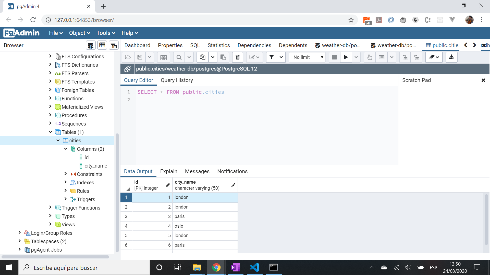
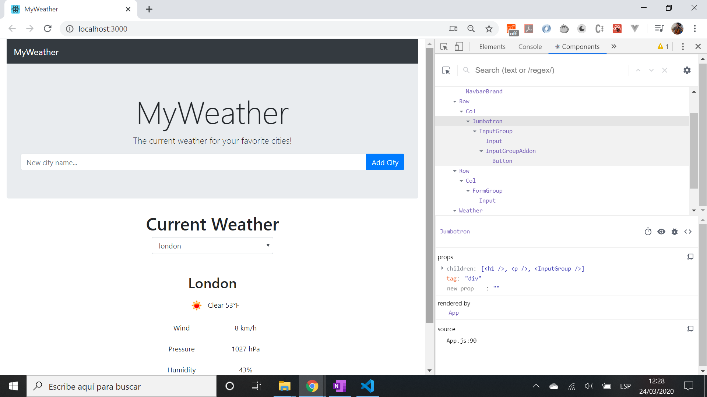

# :zap: PERN Full Stack Database

* PostgreSQL Express React Node (PERN) full-stack app, integrates React frontend with Node.js backend. Currently shows weather data from [OpenWeather API](https://openweathermap.org/api). Tutorial code (see 'Inspiration' below)

*** Note: to open web links in a new window use: _ctrl+click on link_**

## :page_facing_up: Table of contents

* [General info](#general-info)
* [Screenshots](#screenshots)
* [Technologies](#technologies)
* [Setup](#setup)
* [Features](#features)
* [Status](#status)
* [Inspiration](#inspiration)
* [Contact](#contact)

## :books: General info

### Backend

* PostgreSQL needs to be installed and running - I started it from my Windows 10 PostgreSQL 12 dropdown option 'SQL shell (psql)'
* Postman used to test the backend before frontend was available
* Postgresql shell commands: `\l` list all databases. `\c database1` connect to database1. `\dt` inspect tables. `\q` to quit.

### Frontend

* React frontend includes a city selection user input field and a dropdown list of cities. Select a city to see the weather there.
* [JavaScript XML (JSX)](https://reactjs.org/docs/introducing-jsx.html) used to write HTML elements in Javascript

## :camera: Screenshots




## :signal_strength: Technologies - Backend

* [PostgreSQL v12](https://www.postgresql.org/)
* [PostgreSQL Installer for Windows](https://www.postgresqltutorial.com/install-postgresql/)
* [Express.js middleware v4](https://expressjs.com/)
* [Node.js v12](https://nodejs.org/es/)
* [Nodemon](https://www.npmjs.com/package/nodemon) npm module so backend server will automatically restart after code changes
* [OpenWeather API](https://openweathermap.org/api) for weather data

## :signal_strength: Technologies - Frontend

* [React framework v16](https://reactjs.org/)
* [Create React App](https://github.com/facebookincubator/create-react-app) used to bootstrap frontend React app
* [Bootstrap v4](https://getbootstrap.com/) component library

## :floppy_disk: Setup - Backend

* Change to `/server` directory
* Install dependencies using `npm i`
* Install [nodemon v2](https://www.npmjs.com/package/nodemon) globally if you don't already have it
* Install [PostgreSQL](https://www.postgresql.org/) & run it (requires the password you created during installation)
* Add postgresql database & weather API access credentials to .env file
* Run `nodemon server` for a dev server on port 5000

## :floppy_disk: Setup - Frontend

* Change to `/client` directory
* Install dependencies using `npm i`. (I have not tried this method and cannot be sure it will work)
* Alternatively - and better - bootstrap a new React project using `npx create-react-app my-app`
* Run `npm start`. Frontend will open at `http://localhost:3000/`

## :floppy_disk: Setup - Full stack

* From top level `\pern-stack-database` run `npm run dev` for a dev server on port 5000 and a React fontend at `http://localhost:3000/`

## :computer: Code Examples - Backend

* [Static method used](https://javascript.info/static-properties-methods) to add city to database list of cities.

```javascript
  // callback function - if error return it to callback. If no error then return rows (empty set)
  static insert (city, callback) {
    db.query('INSERT INTO cities (city_name) VALUES ($1)', [city], (err, res) => {
      if (err.error)
        return callback(err);
      callback(res);
    });
  }
```

## :computer: Code Examples - Frontend

* method to add a city

```javascript
// fetch an object that has a city property
  // after getting city list clear input field
  handleAddCity = () => {
    fetch('/api/cities', {
      method: 'post',
      headers: { 'Content-Type': 'application/json' },
      body: JSON.stringify({ city: this.state.newCityName })
    })
    .then(res => res.json())
    .then(res => {
      this.getCityList();
      this.setState({ newCityName: '' });
    });
  };
```

## :cool: Features - Backend

* All data stored in PostgreSQL database that can also be viewed and changed from the PostgreSQL shell (psql)

## :cool: Features - Frontend

* React app created from the command prompt using [Create React App](https://reactjs.org/docs/create-a-new-react-app.html)
* Uses the [Bootstrap basic table](https://www.w3schools.com/bootstrap/bootstrap_tables.asp) to list todos
* [Bootstrap 4 Modal](https://www.w3schools.com/bootstrap4/bootstrap_modal.asp) dialog box

## :clipboard: Status & To-Do List

* Status: Working front and back ends. App works and stores city names in PostgreSQL database. Deploy to Heroku not working - could be npm dependency issues or missing API access credentials in Heroku.
* To-Do: Change backend so it checks if city already in database before adding it. Add commenting. Add functionality
* Solve deploy issues: retry video 4 from 9.10 to create the correctly named database

## :clap: Inspiration/General Tools

* [Full Stack React App Tutorial (Beginners) | Part #1 – Introduction](https://www.youtube.com/watch?v=Z4jCvpSROp8&t=1s)
* [Full Stack React App Tutorial (Beginners) | Part #2 – Back End](https://www.youtube.com/watch?v=Bz0oxKrOcNk)
* [Full Stack React App Tutorial (Beginners) | Part #3 – Front End](https://www.youtube.com/watch?v=0RtSiP5Dnn8)
* [Full Stack React App Tutorial (Beginners) | Part #4 – Deployment](https://www.youtube.com/watch?v=0eGA1zYvyeU)
* [Full Stack React App Tutorial (Beginners) | Part #5 – Best Practices (Bonus)](https://www.youtube.com/watch?v=uajUz8rswyM)
* [React documentation](https://reactjs.org/docs/getting-started.html)
* [PostgreSQL Quick Command List](http://jcsites.juniata.edu/faculty/rhodes/dbms/pgsql.htm)
* [Enable Emmet support for JSX in Visual Studio Code | React](https://medium.com/@eshwaren/enable-emmet-support-for-jsx-in-visual-studio-code-react-f1f5dfe8809c)
* [js-beautify for VS Code](https://marketplace.visualstudio.com/items?itemName=HookyQR.beautify)

## :envelope: Contact

* Repo created by [ABateman](https://www.andrewbateman.org) - you are welcome to [send me a message](https://andrewbateman.org/contact)
